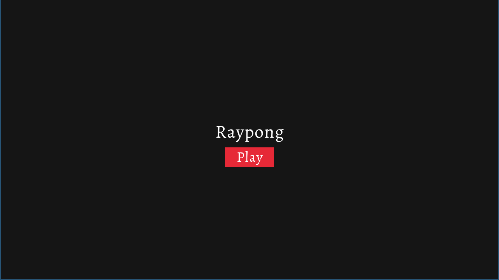
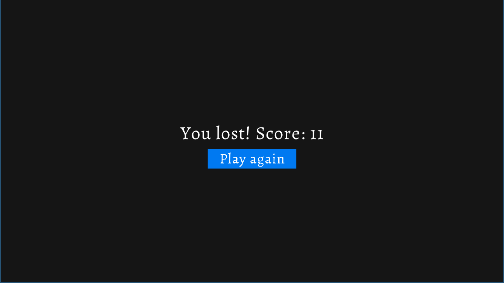

# Raypong

A simple ping-pong game written in C with the [Raylib](https://github.com/raysan5/raylib) Graphics library.

## Description

**Raypong** is a simple ping-pong game which allows two users to play a ping-pong game together, sharing the keyboard. The ball will be faster and faster and the user will need to be quick in order to get a high score.

The two bars in the game are moved with the mouse cursor, and can be played only by one player.

### Screenshots






## Build the project

First of all, you have to clone this repository with the [Raylib](https://github.com/raysan5/raylib) submodule:

```console
$ git clone --recursive https://github.com/Androl404/raypong # Recursive clone with the submodule
```

This project can be build with the script `build.sh`. We use the `clang` compiler so make sure it is in your path. The game can also be build with the GNU compiler (`gcc`), it also works (you can change in the `build.sh` file).

Some dependencies are required in order to build this project, `raylib` is included in the repo, but you will also need the libraries `GL` (OpenGL), `m`, `pthread` (for multithreading), `dl`, `rt` and `X11`. Use your packet manager to install these libraries.

```console
$ ./build.sh # To build the project (on GNU/Linux and macOS)
$ ./build/raypong # To launch the game
```

On Windows, the MSVC compiler (`cl.exe`) must be installed (with or without Visual Studio). A Powershell script can be launched in the Visual Studio Developer Command Prompt in order to compile the game.

```console
> powershell ./build.ps1
```

*When the game will be in a releasable state, we plan to also compile it to WebAssembly so the users will be able to play the game in the browser.*

## Contribution

You are free to fork this project and contribute to it (only if you want to) by making a pull request or opening and issue. Please add some details with the modification you are pushing if you are making a pull request or describe what went wrong if you are opening an issue.

## Licence

This project is licenced beyond the `MIT` licence. You are free to do whatever you want with this project. The author can not be responsible for anything that happen to your system.
